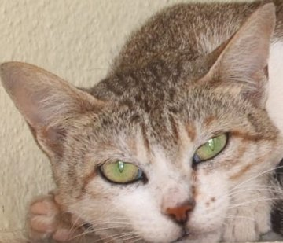
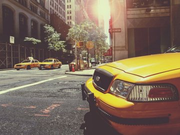
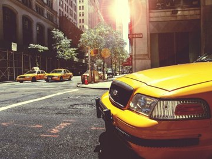
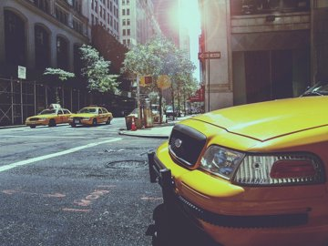
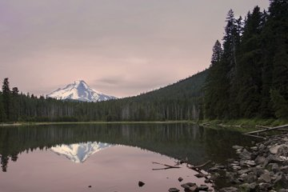
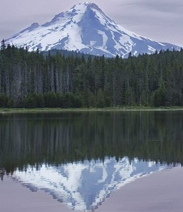
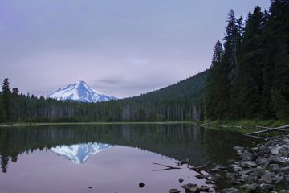
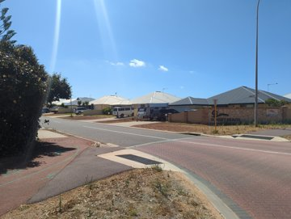
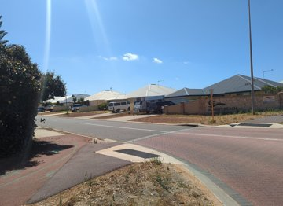
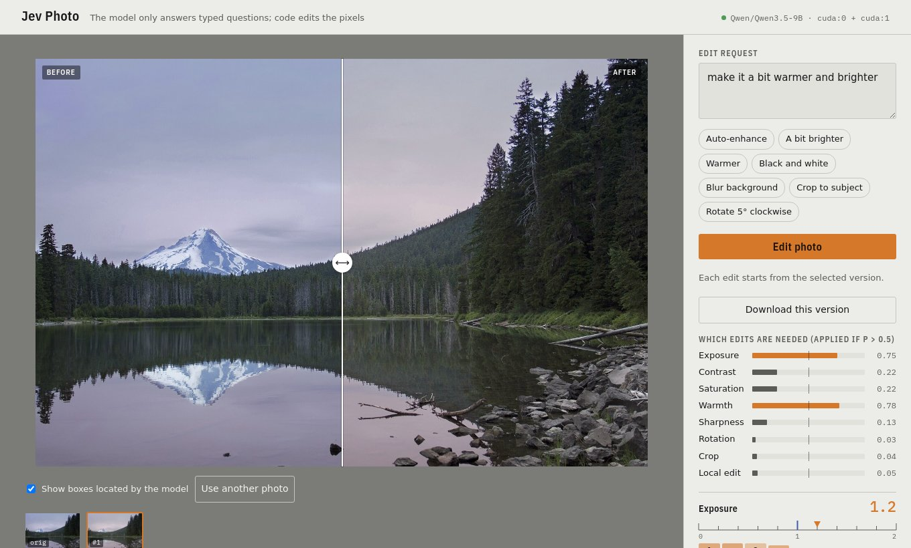

# Jev Photo Control

**Edit photos by asking a vision model typed questions.** Jev Photo Control runs **Qwen3.5-9B** locally and turns
its answers into photo edits using the ideas of **[jev-numeric](https://github.com/Bring-AI/jev-numeric)**. Some
questions are yes/no: *does this request need a brightness change?* Some are choices: *blur inside the box or
outside it?* Others ask for a number (*how much brighter?*) or a box (*where is the subject?*). The model never
writes free text and never touches pixels. It answers the questions, and deterministic code applies the edit.

- **Qwen3.5-9B** (bf16, unmodified weights, no training, RLHF or calibration) scores the candidate answers. The
  engine is a PyTorch port of [jev-visual](https://github.com/hr98w/jev-visual): the image and context are
  prefilled once, and every question branches from that cache.
- **jev-numeric** provides the `number` type. A value on a grid `[lower, upper)` with a given resolution is found
  by repeatedly splitting the current interval and choosing the part that holds it. The editor uses a variant
  that makes each choice at the model's own answer position, one digit at a time
  (see [Numbers](#numbers-interval-vs-digits)).

## Results

Four CC0 photos and twelve prompts. **The prompts were fixed before the first run and every result is shown,
failures included; nothing was re-rolled.** The table was generated by `python -m examples.showcase`. Each edit
took 0.45–2.0 s on one RTX A6000. Box coordinates use the model's native 0–1000 scale.

| Input | Prompt | What the model decided | Output |
|---|---|---|---|
|  | “blur the background” | blur everything but box [108, 304, 807, 717] |  |
|  | “crop tightly around the cat's face” | crop box [108, 361, 384, 716] |  |
|  | “make it black and white” | saturation ×0.0 |  |
|  | *(empty: auto-enhance)* | contrast ×1.2 |  |
|  | “remove the orange color cast so it looks natural” | warmth -0.8 |  |
|  | “blur everything except the yellow taxi in front” | blur everything but box [442, 310, 1000, 1000] |  |
|  | “make it warmer, like golden hour” | warmth +0.8 |  |
|  | “crop to the snowy mountain and its reflection” | crop box [158, 411, 411, 851] |  |
|  | “make the colors more vivid” | saturation ×1.3 |  |
|  | *(empty: auto-enhance)* | no edit |  |
|  | “darken the bright sky” | no edit |  |
|  | “rotate 3 degrees counter-clockwise” | rotate +3.0° |  |

What went wrong:

- **“darken the bright sky” did nothing.** The local-edit gate returned P = 0.25 and the exposure gate stayed
  below 0.5, so no operation passed the threshold.
- **Auto-enhance on the taxi** only raised contrast. The warm, flared filter stayed (warmth gate P = 0.25).
  Auto-enhance on the beach made no change.
- **Taxi background blur:** the box around the taxi is right, but GrabCut cut the headlight out of the subject
  mask, so it got blurred. It also kept a small red sign in the background sharp.
- **“golden hour”:** the model's warmth reading (+0.8) is reasonable, but the warmth operation (red up, blue
  down) turns the lavender sky pink instead of golden. This is a flaw in `ops.apply_warmth`, not in the
  model's answer.

Every gate probability, digit-by-digit reading and box is saved in
[`docs/showcase/results.json`](docs/showcase/results.json).

## Web app



Add a photo (drop it, choose it or paste it), type a request or leave the field empty to auto-enhance, then
click **Edit photo**. The page shows:

- a before/after split, or a side-by-side view when a crop or rotation changes the aspect ratio;
- the boxes the model located;
- the probability for each gate;
- a gauge for each number, with the probability of every character the model wrote.

Every edit starts from the selected version, so you can chain edits or go back through the history strip.

## How it works

```
photo (a ≤1024 px copy) + request  ─►  vision encoder + prefill, once
  1  gates     8 yes/no questions: exposure, contrast, saturation, warmth, sharpness,
               rotation, crop, local edit. An edit runs only if P > 0.5.
  2  amounts   `number` for each gated parameter, plus two `choice`s for local edits
               (which operation; inside the box or around the subject)
  3  boxes     `box` for the crop and local-edit rectangles
  ─►  every question branches from the same cache and runs in batches
  ─►  PIL / OpenCV apply the edit to the full-resolution photo (up to 4096 px)
```

| Question type | Answer | How it is read |
|---|---|---|
| `choice`, `noul` (yes/no), `score` | option probabilities | logits of lettered options, as in jev-visual |
| `number`, `decoding="interval"` (default) | value on the grid | **jev-numeric**: pick one of K sub-intervals per round (K = 10 by default) |
| `number`, `decoding="digits"` | value on the grid | constrained walk over sign / digits / `.` / end at the answer position, then snapped to the grid |
| `box` | `bbox_2d` on a 0–1000 scale | the same walk inside Qwen's native `{"bbox_2d": [` format |

Qwen3.5 mixes Gated DeltaNet layers with attention layers. Branching the shared prefix therefore copies **both**
the KV cache and the DeltaNet conv/recurrent states (`jev_photo/jev/adapter_torch.py`). Suffixes use explicit
M-RoPE positions. Only the positions that are scored are projected through the LM head.

**Which parts need local model access.** `choice`/`noul`/`score` and `number` with `interval` only use
multiple-choice questions, so they could run on the official Jev API. `digits` and `box` need something the API
does not offer: they pre-write part of the assistant's answer (`Answer:\n1.` or `{"bbox_2d": [`) and read the
distribution of the next token. That makes them constrained decoding on a local model rather than a pure
Jev-style decision interface.

### Numbers: interval vs digits

This is a rough check, not an accuracy study. It uses 14 edit requests, written by hand after interval decoding
had already failed on some of them, on one photo, with hand-set accepted ranges and no option-order control
(`python -m benchmarks.number_decoding`).

| Decoding | Correct | Mean time |
|---|---|---|
| `digits` | 14/14 | 226 ms |
| `interval`, K = 10 | 10/14 | 159 ms |
| `interval`, K = 4 | 8/14 | 199 ms |

The interval misses cluster on the option “0 <= value < …”, which is also the first option listed. For example,
“rotate 10 degrees clockwise” was read as 0. K = 4 also produces uneven boundaries such as 6, 12.5 and 0.35. The
jev-numeric authors found the opposite ranking on the Jev API (digit-by-digit with the prefix was worse), and
their digit questions were posed differently, so the two results are not directly comparable. Per-round
probabilities are in [`artifacts/number-decoding.json`](artifacts/number-decoding.json).

For boxes, lettered intervals over a coordinate grid failed completely: the four edges got nearly identical
distributions. Reading the model's trained `bbox_2d` format worked, so `box` uses it.

## Quick start

You need an NVIDIA GPU with about 20 GB free for each model replica. Tested on 2× RTX A6000 (driver 535 /
CUDA 12.2) with Python 3.12.

```bash
uv venv --python 3.12 .venv
VIRTUAL_ENV=.venv uv pip install torch torchvision --index-url https://download.pytorch.org/whl/cu126
VIRTUAL_ENV=.venv uv pip install -e '.[test]'

JEV_PHOTO_DEVICES=cuda:0,cuda:1 .venv/bin/jev-photo-server --port 8790
```

The first start downloads about 19 GB of weights. The server loads one full replica per listed GPU, warms each
one up (flash-linear-attention compiles Triton kernels), and sends each request to a free replica. Open
http://127.0.0.1:8790. On a remote machine, forward the port first with
`ssh -L 8790:127.0.0.1:8790 <host>`. The API docs are at `/docs`.

### API

`POST /v1/edit` takes `{"image": "<data URL>", "instruction": "blur the background"}` and returns the edited
image together with the gates, amounts, boxes and timings.

`POST /v1/judge` answers arbitrary typed questions, and the types can be mixed in one request:

```json
{"image": "data:image/jpeg;base64,...", "questions": {
  "animal": {"type": "choice", "instructions": "Which animal is shown?", "criteria": {"cat": "A cat", "dog": "A dog"}},
  "legs":   {"type": "number", "instructions": "How many legs are visible?", "range": [0, 10], "resolution": 1},
  "area":   {"type": "number", "instructions": "What fraction of the image does the animal cover?",
             "range": [0, 1], "resolution": "0.05", "decoding": "digits"},
  "head":   {"type": "box", "instructions": "the cat's head"}}}
```

## Verification

```bash
.venv/bin/python -m pytest -q                               # 18 unit tests, no model needed
.venv/bin/python -m examples.verify_scoring cuda:1 float32  # shared prefix vs independent vs stock forward
.venv/bin/python -m benchmarks.number_decoding cuda:1       # interval (K=10, K=4) vs digits
.venv/bin/python -m examples.http_smoke                     # end-to-end, against a running server
.venv/bin/python -m examples.showcase                       # regenerates the results table
```

- **Cache branching is exact up to float precision.** In float32, shared-prefix scores match one full forward
  per question within 0.0035. Sequence scores match the stock transformers `model(**inputs)` within 0.0006. In
  bf16 the gaps grow to 0.4 on low-probability candidates, which is bf16 rounding
  ([float32](artifacts/scoring-verification-float32.json), [bf16](artifacts/scoring-verification-bfloat16.json)).
- **Speed** (RTX A6000, bf16, ~850 prefix tokens): five mixed questions take 0.43 s with the shared prefix and
  1.9 s with one full forward per question.

## Limitations

- Probabilities show relative preference among the listed options. They are **not calibrated** and do not
  measure correctness.
- Amounts like “a bit” or “a lot” follow the model's taste. Gates can miss requests, as with the sky and
  auto-enhance above.
- Local edits are rectangles. Around-the-subject edits use GrabCut seeded with the model's box, which can cut
  the subject wrongly.
- Decoding is greedy with no backtracking, and values are clamped to preset ranges.
- Only Qwen3.5 (`qwen3_5`) is supported. The cache is reused only within a request, and branching copies
  tensors (it is not zero-copy).
- This is an independent experiment and does not reflect how TypeSafe Jev works.

## Credits

Code ported from [jev-visual](https://github.com/hr98w/jev-visual) (MIT) and the interval algorithm from
[jev-numeric](https://github.com/Bring-AI/jev-numeric) (MIT). See [THIRD_PARTY.md](THIRD_PARTY.md). Photo sources
and CC0 licenses are listed in [examples/photos/SOURCES.md](examples/photos/SOURCES.md). No license has been
chosen for this repository's own code yet.
